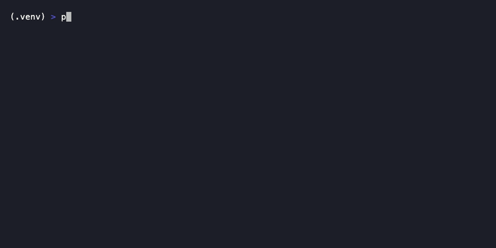

# ai-agent-guardrails

[](https://github.com/goshipra/ai-agent-guardrails/actions/workflows/ci.yml)
[](https://pypi.org/project/ai-agent-guardrails/)
[](https://pypi.org/project/ai-agent-guardrails/)
[](LICENSE)

A small, tool-agnostic policy layer that sits between an autonomous AI coding
agent and the shell: it intercepts a proposed command, checks it against a
declarative threat model, and blocks the genuinely destructive ones —
`terraform destroy` with no reviewed plan, a namespace wipe, an unscoped
`rm -rf`, a force-push to `main`, an IAM policy that grants `*` on `*` — before
they execute, with every decision written to a structured audit log.

As coding agents (Claude Code, Cursor, and others) move from suggesting
commands to actually running them, they need the same change-management
discipline a human on-call engineer operates under: nothing destructive ships
without a second set of eyes, and there's a record of what ran and why. Going
into 2026, agent observability and guardrails have stopped being an
afterthought bolted on after an incident — they're treated as a baseline
requirement of AI-infrastructure design, on the same footing as auth or
logging. This project is a small, concrete, working example of that layer:
not a framework, not a platform, just the policy engine, an audit trail, a
CLI, and one real integration (Claude Code), built to be read end-to-end in
one sitting.



## Threat model

Every rule lives in [`policies/default.yaml`](policies/default.yaml) as a
regex or a small Python check function (see
[`guardrails/checks.py`](guardrails/checks.py) for the ones that need more
than a regex — e.g. "was a plan reviewed earlier in this session?").

| Pattern | Why it's dangerous | Action |
|---|---|---|
| `terraform destroy` with no `-target` and no evidence of a reviewed `terraform plan -out=` | Can tear down an entire state file's worth of infrastructure with nobody having seen what would actually be deleted | **BLOCK** |
| `kubectl delete namespace <ns>` | Deletes every resource in the namespace — pods, services, secrets, PVCs, config — with no per-resource confirmation | **BLOCK** |
| `kubectl delete ... --all` | Removes every object of that kind in the target scope in one shot; equivalent blast radius to a namespace wipe | **BLOCK** |
| `rm -rf /`, `rm -rf ~`, `rm -rf .`, or `rm -rf` with no path at all | Recursive+force delete at a filesystem root/home/cwd, or with no path scoping, can destroy a machine irreversibly and near-instantly | **BLOCK** |
| `git push --force` / `-f` to `main`/`master`/`production` | Rewrites shared history other engineers and CI/CD depend on; can silently drop merged commits | **BLOCK** |
| `git push --force` / `-f` to any other branch | Still rewrites history, but the blast radius is smaller if the branch isn't shared | **WARN** |
| IAM policy statement with `"Resource": "*"` **and** a broad action (`iam:*`, `*:*`) | Grants effectively unrestricted access to the whole account — one of the most common causes of cloud account takeover | **BLOCK** |
| Disabling MFA / deleting an IAM user or access key | Removes an identity's ability to authenticate, or a control protecting it — accidental or malicious, this can lock out real operators or open a hole | **BLOCK** |
| `DROP TABLE` / `DROP DATABASE` / `TRUNCATE TABLE` outside a clearly-named migration/rollback file | Irreversible without a backup; expected and reviewable inside a migration, much easier to hit the wrong table when run ad hoc | **WARN** |
| `curl`/`wget` piped directly into `sh`/`bash` | Executes unreviewed, unpinned, potentially-mutable remote code with no chance to inspect it first — a common supply-chain vector | **WARN** |

Anything that doesn't match a rule is **ALLOW**ed — this is a blocklist for
known-dangerous patterns, not a default-deny sandbox.

## Architecture

```
                 ┌────────────────────────┐
 proposed        │                        │      ALLOW  ──▶ command runs
 shell command ──▶│      PolicyEngine      │
 + context        │  (policies/*.yaml +    │      WARN   ──▶ command runs,
                 │   guardrails/checks.py) │                 reason logged
                 └───────────┬────────────┘
                             │                     BLOCK  ──▶ command refused,
                             ▼                                reason surfaced
                  ┌─────────────────────┐
                  │     AuditLogger      │  ──▶  ~/.guardrails/audit.jsonl
                  │ (JSON lines, one     │        (tail into Loki/ELK/
                  │  record per call)    │         Langfuse/etc.)
                  └─────────────────────┘
```

Two callers drive this today: the standalone `guard` CLI, and the Claude Code
`PreToolUse` hook. Both go through the same `PolicyEngine.evaluate()` — the
policy logic doesn't know or care which one called it, which is the point:
adding a Cursor, CI-bot, or LangGraph-tool integration means writing a thin
adapter that extracts a command string and calls `evaluate()`, not touching
the rules.

## Quickstart

```bash
git clone <this-repo> ai-agent-guardrails
cd ai-agent-guardrails
python3 -m venv .venv && source .venv/bin/activate
pip install -e .

guard check "terraform destroy"
# [BLOCK] 'terraform destroy'
#   rule:   terraform_destroy_unreviewed
#   reason: 'terraform destroy' with no -target and no evidence a plan was
#           generated and reviewed first ...
# (exit code 1)

guard exec -- ls
# [ALLOW] 'ls'
#   reason: No policy violation detected.
# <actual `ls` output follows>

guard exec -- rm -rf /
# [BLOCK] ... refusing to execute: command blocked by policy. (exit code 1, `rm` never runs)
```

Every call above appends a JSON record to `~/.guardrails/audit.jsonl`.
Global flags (`--json`, `--audit-log`, `--policy-dir`, `--context`,
`--no-audit`) go **before** the subcommand, e.g. `guard --json check "..."`.

## Claude Code integration

[`integrations/claude_code/pretooluse_hook.py`](integrations/claude_code/pretooluse_hook.py)
implements Claude Code's `PreToolUse` hook contract: it reads the tool-call
JSON from stdin, pulls the Bash command out of it, runs it through
`PolicyEngine.evaluate()`, and on BLOCK prints a JSON decision to stdout plus
exits non-zero so Claude Code refuses to run the command. See the docstring
at the top of that file for the exact assumptions this makes about Claude
Code's hook I/O — **the hook schema has changed across Claude Code releases,
and this is a best-effort reference implementation, not a guarantee it
matches whatever version you're running.** Verify against your installed
version's hook docs before trusting it in anything that matters.

[`integrations/claude_code/CLAUDE.md.snippet`](integrations/claude_code/CLAUDE.md.snippet)
has the `.claude/settings.json` hook registration and a sample `CLAUDE.md`
section to paste into a project that wires this in.

This project is deliberately not Claude-Code-specific at its core — Claude
Code is one integration among several a policy engine like this should
support (Cursor, a CI approval bot, a custom agent loop) and the
`guardrails/` package has no dependency on it.

## Design decisions

**Why a rule-based engine and not an LLM classifier?** A BLOCK decision here
is safety-critical: it has to be deterministic, explainable, and auditable —
the same command should get the same decision every time, and the reason
needs to be traceable to a specific rule, not a model's momentary judgment.
An LLM classifier is a genuinely good complement for the *fuzzy* cases —
"does this diff look like it's quietly widening an IAM policy," "does this
commit message match what the diff actually does" — where the answer is a
judgment call, not a fact. But mixing that into the hard BLOCK path means a
prompt-injected or just-wrong model call could either wave through something
that should never run, or refuse something completely benign for no
reproducible reason. So: deterministic pattern-matching for the tier where
being wrong is expensive (BLOCK), with room to layer a classifier on top for
the WARN tier where a human is going to look at the output anyway. This
mirrors how the rest of this author's tooling treats AI — as a risk-checker
that flags things for a human, never as the thing making the final call.

**Why regex + small Python checks instead of a full AST/shell parser?** Most
of these patterns (branch names, path literals, JSON key/value pairs) are
easy to catch reliably with a regex or a couple of `shlex.split()` calls, and
keeping the rule format readable in YAML is worth more here than parsing
correctness for adversarial shell syntax. This is explicitly a reference
project, not a hardened sandbox — see "Status" below.

## Status

This is a **portfolio / reference project** demonstrating the pattern, not a
hardened production security boundary. In particular:

- Pattern matching can be evaded by determined obfuscation (`rm -rf $(echo /)`,
  base64-encoded commands, etc.) — it's built to catch the common, honest
  case of an agent about to run something destructive, not to resist an
  adversary deliberately trying to get around it.
- It has one real integration (Claude Code). A Cursor or generic-CI adapter
  would follow the same shape: extract a command string, call
  `PolicyEngine.evaluate()`, act on the `Decision`.
- The audit log is local JSONL by design (zero-dependency); wiring it into
  an actual Loki/ELK/Langfuse pipeline is a matter of tailing the file, not
  code changes here.

### Extending the policy set

Add a rule to `policies/default.yaml`:

```yaml
- id: my_new_rule
  action: WARN   # or BLOCK
  pattern: '(?i)some regex'   # or: check: my_check_function
  reason: >
    Explain *why* this is dangerous, not just what matched.
```

For anything that needs more context than a regex over the raw command
string (session history, current branch, file path, etc.), add a
`check(command: str, context: dict) -> bool` function to
`guardrails/checks.py` and reference it by name via `check:` instead of
`pattern:`. Run `pytest -q` after any change — every rule above has both a
BLOCK/WARN test and at least one matching ALLOW test to guard against
regressions in either direction.

---

This is part of a small set of AI-infrastructure portfolio projects; sibling
repos (`rag-mlops-pipeline`, `llm-observability-stack`, `ai-infra-terraform`)
cover the rest of the stack — no links yet since they may not all be pushed.
